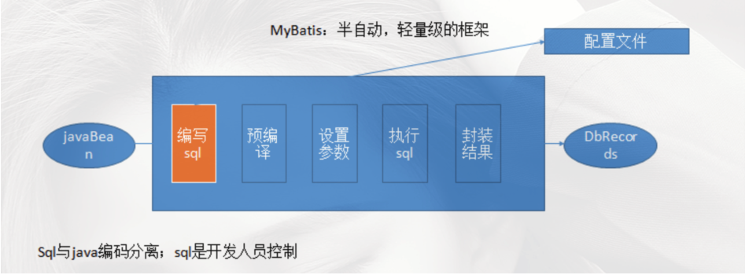
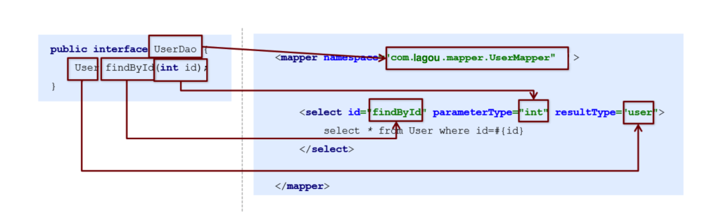
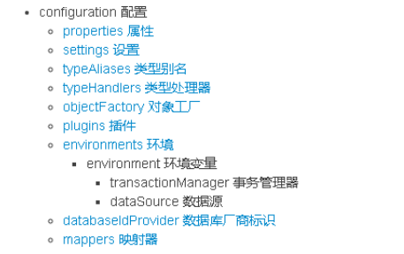
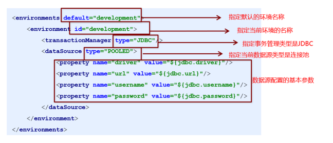

# JDBC问题总结

## 原始jdbc开发存在的问题

1. 数据库连接创建、释放频繁造成系统资源浪费，从而影响系统性能。
2. Sql语句在代码中硬编码，造成代码不易维护，实际应用中sql变化的可能较大，sql变动需要改变java代码。
3. 使用preparedStatement向占有位符号传参数存在硬编码，因为sql语句的where条件不一定，可能多也可能少，修改sql还要修改代码，系统不易维护。
4. 对结果集解析存在硬编码(查询列名)，sql变化导致解析代码变化，系统不易维护，如果能将数据库记录封装成pojo对象解析比较方便。

## 问题的解决思路

1. 使用数据库连接池初始化连接资源
2. 将sql语句抽取到xml配置文件中
3. 使用反射、内省等底层技术，自动将实体与表进行属性与字段的自动映射

# 自定义实现框架

## 使用端

提供核心配置文件：

1. sqlMapConfig.xml : 存放数据源信息，引入mapper.xml
2. Mapper.xml : sql语句的配置文件信息

## 框架端

1. 读取配置文件 读取完成以后以流的形式存在，我们不能将读取到的配置信息以流的形式存放在内存中，不好操作，可以创建javaBean来存储
    1. Configuration : 存放数据库基本信息、Map<唯一标识，Mapper>唯一标识：namespace + "." + id
    2. MappedStatement：sql语句、statement类型、输入参数java类型、输出参数java类型
2. 解析配置文件 创建sqlSessionFactoryBuilder类： 方法：sqlSessionFactory build()：
    1. 使用dom4j解析配置文件，将解析出来的内容封装到Configuration和MappedStatement中,
    2. 创建SqlSessionFactory的实现类DefaultSqlSession
3. 创建SqlSessionFactory： 方法：openSession() : 获取sqlSession接口的实现类实例对象
4. 创建sqlSession接口及实现类：主要封装crud方法
    1. 方法：selectList(String statementId,Object param)：查询所有
    2. selectOne(String statementId,Object aram)：查询单个；具体实现：封装JDBC完成对数据库表的查询操作

# Mybatis基本概念

## 对象/关系数据库映射（ORM）

ORM全称Object/Relation Mapping：表示对象-关系映射的缩写；ORM完成面向对象的编程语言到关系数据库的映射。 ORM框架实现的效果：把对持久化对象的保存、修改、删除等操作，转换为对数据库的操作。
MyBatis是一款优秀的基于ORM的半自动轻量级持久层框架，它支持定制化SQL、存储过程以及高级映射。MyBatis避免了几乎所有的JDBC代码和手动设置参数以及获取结果集。MyBatis可以使用简单的XML或注解来配置和映射原生类型、接口和Java的POJO
（Plain Old Java Objects,普通老式Java对象） 为数据库中的记录。



## 开发步骤

1. 添加MyBatis的坐标
2. 创建user数据表
3. 编写User实体类
4. 编写映射文件UserMapper.xml
5. 编写核心文件SqlMapConfig.xml
6. 编写测试类

## 代理开发方式

采用 Mybatis 的代理开发方式实现 DAO 层的开发，这种方式是我们后面进入企业的主流。 Mapper 接口开发方法只需要程序员编写Mapper 接口（相当于Dao 接口），由Mybatis
框架根据接口定义创建接口的动态代理对象，代理对象的方法体同上边Dao接口实现类方法。 Mapper 接口开发需要遵循以下规范：

1. Mapper.xml文件中的namespace与mapper接口的全限定名相同
2. Mapper接口方法名和Mapper.xml中定义的每个statement的id相同
3. Mapper接口方法的输入参数类型和mapper.xml中定义的每个sql的parameterType的类型相同
4. Mapper接口方法的输出参数类型和mapper.xml中定义的每个sql的resultType的类型相同
   
```java
```

##配置文件

