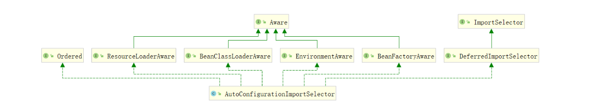

# 1.关于starter

1. spring-boot-starter-parent 通过继承spring-boot-dependencies,从而实现了SpringBoot的版本依赖管理,
   所以我们的SpringBoot工程继承spring-boot-starter-parent后已经具备版本锁定等配置了, 这也就是在 Spring Boot 项目中部分依赖不需要写版本号的原因。
2. spring-boot-starter-web依赖启动器的主要作用是打包了Web开发场景所需的底层所有依赖（基于依赖传递，当前项目也存在对应的依赖jar包）。
   正是如此，在pom.xml中引入spring-boot-starter-web依赖启动器时，就可以实现Web场景开发，而不需要额外导入Tomcat服务器以及其他Web依赖文件等。
   当然，这些引入的依赖文件的版本号还是由spring-boot-starter-parent父依赖进行的统一管理。

# 2.自动配置的原理

## 2.1@SpringBootApplication

```java

@Target({ElementType.TYPE}) //注解的适用范围,Type表示注解可以描述在类、接口、注解或枚举中
@Retention(RetentionPolicy.RUNTIME) //表示注解的生命周期，Runtime运行时
@Documented //表示注解可以记录在javadoc中
@Inherited //表示可以被子类继承该注解
@SpringBootConfiguration // 标明该类为配置类
@EnableAutoConfiguration // 启动自动配置功能
@ComponentScan(excludeFilters = {@Filter(type = FilterType.CUSTOM, classes =
        TypeExcludeFilter.class),
        @Filter(type = FilterType.CUSTOM, classes =
                AutoConfigurationExcludeFilter.class)})
public @interface SpringBootApplication {
    // 根据class来排除特定的类，使其不能加入spring容器，传入参数value类型是class类型。
    @AliasFor(annotation = EnableAutoConfiguration.class)
    Class<?>[] exclude() default {};
// 根据classname 来排除特定的类，使其不能加入spring容器，传入参数value类型是class的全类名字符串数组。

    @AliasFor(annotation = EnableAutoConfiguration.class)
    String[] excludeName() default {};

    // 指定扫描包，参数是包名的字符串数组。
    @AliasFor(annotation = ComponentScan.class, attribute = "basePackages")
    String[] scanBasePackages() default {};

    // 扫描特定的包，参数类似是Class类型数组。
    @AliasFor(annotation = ComponentScan.class, attribute =
            "basePackageClasses")
    Class<?>[] scanBasePackageClasses() default {};
}
```

### @SpringConfiguration

@SpringBootConfiguration注解内部有一个核心注解@Configuration，该注解是Spring框架提供的，表示当前类为一个配置类（XML配置文件的注解表现形式），并可以被组件扫描器扫描。
由此可见，@SpringBootConfiguration注解的作用与@Configuration注解相同，都是标识一个可以被组件扫描器扫描的配置类，只不过@SpringBootConfiguration是被Spring
Boot进行了重新封装命名而已。

```java

@Target({ElementType.TYPE})
@Retention(RetentionPolicy.RUNTIME)
@Documented
@Configuration // 配置类的作用等同于配置文件，配置类也是容器中的一个对象
public @interface SpringBootConfiguration {
}
```

### @AutoConfigurationPackage

```java
package org.springframework.boot.autoconfigure;

@Import(AutoConfigurationPackages.Registrar.class) // 导入Registrar中注册的组件
public @interface AutoConfigurationPackage {
}
```

@AutoConfigurationPackage ：自动配置包，它也是一个组合注解，其中最重要的注解是@Import(AutoConfigurationPackages.Registrar.class) ， 它是Spring
框架的底层注解，它的作用就是给容器中导入某个组件类，例如@Import(AutoConfigurationPackages.Registrar.class) ， 它就是将Registrar 这个组件类导入到容器中，
可查看Registrar类中registerBeanDefinitions 方法：

```java
@Override
public void registerBeanDefinitions(AnnotationMetadata metadata,BeanDefinitionRegistry registry){
        register(registry,new PackageImport(metadata).getPackageName());
        }
```

AutoConfigurationPackages.Registrar这个类就干一个事，注册一个Bean ，这个Bean 就是
org.springframework.boot.autoconfigure.AutoConfigurationPackages.BasePackages ， 它有一个参数，这个参数是使用了@AutoConfigurationPackage
这个注解的类所在的包路径,保存自动配置类以供之后的使用， 比如给JPA entity 扫描器用来扫描开发人员通过注解@Entity 定义的entity 类。

### @EnableAutoConfiguration

@EnableAutoConfiguration就是借助@Import来收集所有符合自动配置条件的bean定义，并加载到IoC容器。

```java
package org.springframework.boot.autoconfigure;

// 自动配置包
@AutoConfigurationPackage
// Spring的底层注解@Import，给容器中导入一个组件；
// 导入的组件是AutoConfigurationPackages.Registrar.class
@Import(AutoConfigurationImportSelector.class)
// 告诉SpringBoot开启自动配置功能，这样自动配置才能生效。
public @interface EnableAutoConfiguration {
    String ENABLED_OVERRIDE_PROPERTY = "spring.boot.enableautoconfiguration";

    // 返回不会被导入到 Spring 容器中的类
    Class<?>[] exclude() default {};

    // 返回不会被导入到 Spring 容器中的类名
    String[] excludeName() default {};
}
```

@Import({AutoConfigurationImportSelector.class}) ：将AutoConfigurationImportSelector 这个类导入到Spring 容器中，
AutoConfigurationImportSelector 可以帮助Springboot 应用将所有符合条件的@Configuration 配置都加载到当前SpringBoot 创建并使用的IOC 容器(
ApplicationContext )中。

可以看到AutoConfigurationImportSelector 重点是实现了DeferredImportSelector 接口和各种 Aware 接口，然后DeferredImportSelector 接口又继承了ImportSelector 接口。